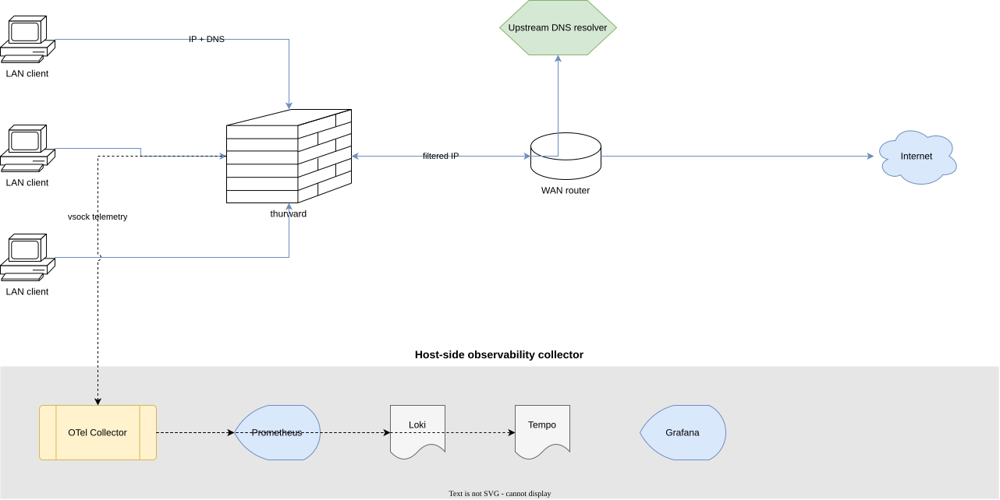

# 01 — System context

*Audience: anyone trying to understand what thurward talks to and what
talks to it. Pairs with the system-context diagram.*

## The components outside thurward

Four external systems interact with thurward:

### LAN clients

The machines whose traffic thurward filters. They send IP packets out
through thurward (which is their default gateway) and direct DNS
queries to thurward (which is their resolver — necessary for the
DNS-proxy interception scheme; see [ADR 0004](decisions/0004-dns-proxy-for-fqdn-rules.md)).

LAN clients have no idea they're being firewalled at L3/L4. They see
allowed flows succeed and blocked flows fail as if the destination
were unreachable. No ICMP-unreachable messages, no friendly errors —
"silent drop" is the default action.

### Upstream DNS resolver

The recursive DNS resolver thurward forwards queries to (e.g.
`1.1.1.1`, `9.9.9.9`, or a private resolver). Configured at build time
in `rules.yaml`. The proxy preserves the response unchanged before
forwarding it back to the client; it only extracts `(qname, ip, ttl)`
tuples for the `fqdn_set` cache.

### WAN / upstream router

The network thurward forwards permitted traffic *to*. From thurward's
perspective the WAN is opaque; it's just the next hop.

### Host-side observability collector

A stack running on the same hypervisor host as the thurward VM,
consuming the vsock stream and exposing dashboards:

- **OpenTelemetry Collector** — receives logs/metrics/traces from
  vsock (via `socat VSOCK-LISTEN:9000,fork`), routes by content-type
  prefix.
- **Prometheus** — scrapes the collector's `/metrics` exporter for
  per-rule counters, drop reasons, DNS resolution latency, vsock
  backpressure.
- **Loki** — stores the ECS-aligned JSON drop/accept events.
- **Tempo (or Jaeger)** — stores per-flow OTel spans.
- **Grafana** — dashboards over all three backends.

A reference `docker-compose.yml` for the collector stack ships in
`contrib/` of the firewall repo. Operators with their own observability
substrate plug their existing OTel Collector into the vsock egress
(per [ADR 0006](decisions/0006-vsock-for-observability-egress.md))
instead.

## What's notable about the boundaries

- **No inbound management surface.** thurward has no admin port, no
  SSH, no API. Rule changes flow through editing the firewall repo and
  rebuilding the image (see [ADR 0016](decisions/0016-image-per-change-user-deploy.md));
  the firewall itself exposes only the two virtio NICs and
  (optionally) the LAN-side DNS proxy on UDP/53 + TCP/53. The vsock
  channel is host-only, unrouteable.
- **Observability traffic never traverses the data NICs.** It exits via
  virtio-vsock, which is invisible to anyone on the LAN or WAN. See
  [ADR 0006](decisions/0006-vsock-for-observability-egress.md).
- **The upstream resolver is trusted.** thurward forwards client
  queries to it and trusts its answers to populate `fqdn_set`. A
  malicious upstream resolver can poison FQDN policy. Operators
  should use a resolver they trust (and ideally DNSSEC-validating).
- **The operator (or their config-management) is part of the trust
  boundary.** Whoever runs `cosign verify` + `slsa-verifier` and
  installs the image is the gate. Skipping the verification step
  means running an unverified image. The recommended install scripts
  in [06 — Deployment](06-deployment.md) make verification the easy
  path. See [ADR 0010](decisions/0010-supply-chain-hardening.md) and
  [ADR 0016](decisions/0016-image-per-change-user-deploy.md).
