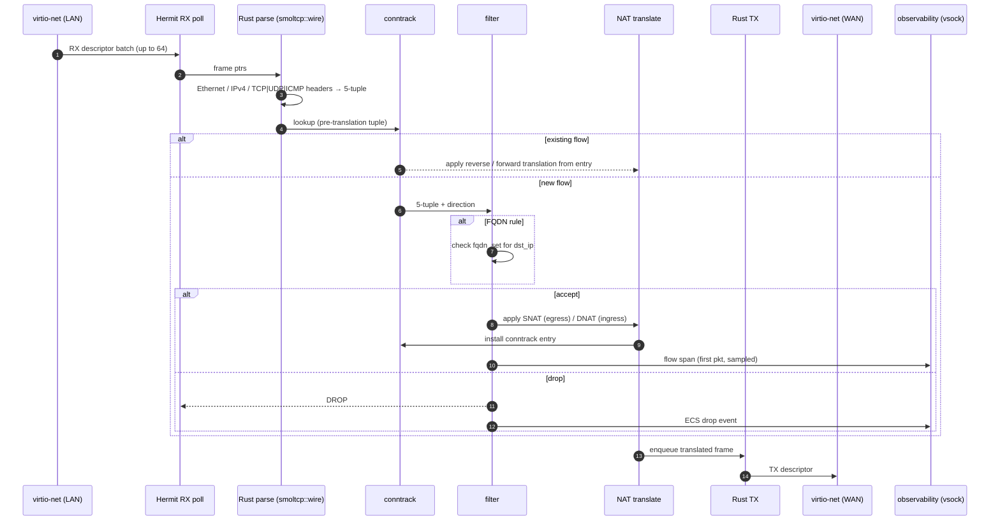

# 02 — Packet path

*Audience: implementers and operators who need to know exactly where
the filter sits, where NAT happens, and what the fast path looks like.*

The decisions framing this chapter:

- [ADR 0017](decisions/0017-hermit-rust-substrate.md) — substrate is
  Hermit + Rust + smoltcp wire types (no socket layer).
- [ADR 0013](decisions/0013-zig-fast-path-on-uknetdev.md) — the
  application owns the data path; no in-image TCP/IP socket layer
  between the driver and the filter.
- [ADR 0003](decisions/0003-inline-middlebox-topology.md) — two NICs;
  source interface determines `direction`.
- [ADR 0014](decisions/0014-stateful-nat.md) — conntrack table and
  SNAT/DNAT translation semantics.

## The hot path

A packet entering thurward's LAN interface and being forwarded out the
WAN interface traverses the following sequence:

<!-- canonical source: diagrams/packet-path.mmd -->


WAN-ingress packets follow the mirror sequence: DNAT lookup runs
*before* the filter scan so rule authors always see real internal
destination IPs (see [ADR 0014](decisions/0014-stateful-nat.md) §
"Filter / NAT ordering").

## Where the code lives

Hermit exposes the virtio-net device through a low-level RX/TX
descriptor API; thurward's Rust crate calls into it directly. The
`main` function spawns one **RX poll thread per interface**, each
running:

```rust
// src/dataplane.rs — sketch, not the implementation
use smoltcp::wire::{EthernetFrame, Ipv4Packet};

let mut rx_buf = [0u8; 64 * MAX_FRAME];   // sized at boot, no allocator on the hot loop
while running.load(Ordering::Acquire) {
    let batch = nic.rx_burst(&mut rx_buf);  // up to 64 frames
    for frame_bytes in batch {
        let eth = match EthernetFrame::new_checked(frame_bytes) {
            Ok(e)  => e,
            Err(_) => { obs.emit_drop(frame_bytes, DropReason::Malformed); continue; }
        };
        match process(eth, src_iface) {
            Verdict::Forward { egress } => egress.nic.tx(frame_bytes),
            Verdict::Drop { reason }    => obs.emit_drop(frame_bytes, reason),
        }
    }
}
```

`process()` does the parse → conntrack → filter → NAT pipeline shown
above, using `smoltcp::wire` types for header inspection and our own
modules for conntrack, NAT, and filter matching. No allocation in the
loop; per-thread scratch buffers are sized at boot.

## What the parser sees

For each packet:

- **Source interface** — distinguishes LAN-ingress from WAN-ingress,
  which sets the rule's `direction` axis.
- **Ethernet header** — used only to confirm IPv4 (IPv6 dropped in v1,
  see [09 — Limitations](09-limitations.md)).
- **IP header** — `src_ip`, `dst_ip`, `protocol`, fragment flags
  (fragments are dropped in v1; no reassembly).
- **L4 header** — `src_port`, `dst_port` for TCP/UDP; type/code for
  ICMP. TCP flags are kept for conntrack state-machine input.

The filter does NOT do payload inspection. No DPI, no L7 — just the
5-tuple, conntrack state, and the FQDN cache lookup.

## Performance notes

- **Target (v1):** ~1 Gbps on a single vCPU. Worst-case 64-byte frames
  fit inside that envelope when the data path is single-threaded and
  the conntrack table hits hot. Realistic mixed-size traffic clears
  it comfortably.
- **Single-thread baseline** is a deliberate choice. Multi-queue +
  per-thread conntrack shards (the 5–10 Gbps stretch in
  [ADR 0013](decisions/0013-zig-fast-path-on-uknetdev.md)) is additive,
  not a redesign.
- **Hot-loop discipline:** no allocator calls, no syscalls (Hermit's
  unikernel model — application runs in kernel space — helps here),
  batched RX/TX descriptors, slice-based smoltcp parsers that don't
  copy, branch-prediction-friendly common-case parsing.
- **Rule matching** is a linear scan of the flat compiled rule table
  ([03 — Rule model](03-rule-model.md)). At v1 rule counts (<200) this
  is fine; a CIDR trie is a known deferred optimisation.
- **Conntrack** is open-addressed hash, keyed on the canonical
  (pre-translation) 5-tuple. Lookup and insert are O(1) amortised;
  eviction is lazy on bucket scan + periodic sweep.
- **`fqdn_set`** stays as in chapter 04: dst-IP-keyed hash, O(1)
  lookup, lazy expiry.
- **Observability emit** happens *after* the forward decision; it
  never gates the data path. Vsock backpressure drops oldest unsent
  lines ([05 — Observability](05-observability.md)).

## What this chapter does not cover

- How rules end up in the table — see [03 — Rule model](03-rule-model.md).
- NAT translation details and rule ordering — see
  [ADR 0014](decisions/0014-stateful-nat.md).
- How `fqdn_set` is populated — see [04 — FQDN & DNS](04-fqdn-and-dns.md).
- What gets emitted to vsock — see [05 — Observability](05-observability.md).
- Conntrack state replication for HA — deferred to v2 with
  [ADR 0015](decisions/0015-active-passive-ha.md); v1 conntrack is
  process-local and lost on restart
  ([09 — Limitations](09-limitations.md)).
