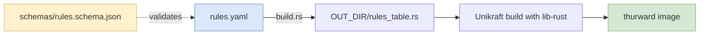

# 03 — Rule model

*Audience: operators writing rules and implementers building the rule
compiler. Pairs with the rule-compilation diagram.*

## `rules.yaml` schema

A worked example:

```yaml
# Optional global settings.
defaults:
  default_action: deny          # zero-trust default
  upstream_dns: 1.1.1.1
  flow_trace_sample_accept: 0.01   # 1% sample on accepted flows
  flow_trace_sample_drop: 1.0      # 100% on dropped flows

# NAT: SNAT/masquerade + static DNAT (port-forward).
# See ADR 0014 for semantics and ordering vs filter rules.
nat:
  snat:
    - out_interface: wan0
      source: 10.0.0.0/24
      masquerade: true               # use wan0's primary IP
      # external_ip: 203.0.113.10    # or pin to a specific WAN IP
  dnat:
    - wan_ip: 203.0.113.10
      wan_port: 443
      to: 10.0.0.5:443
      proto: tcp
      from: 0.0.0.0/0                # optional source CIDR filter

rules:
  - id: allow-dns-out
    name: "LAN can reach the DNS proxy"
    action: accept
    direction: egress             # packet entered LAN-side, leaving WAN-side
    source: 10.0.0.0/24
    destination: 10.0.0.1         # the firewall itself
    destination_port: 53
    protocol: udp

  - id: allow-github-https
    name: "Allow HTTPS to GitHub"
    action: accept
    direction: egress
    source: 10.0.0.0/24
    destination_port: 443
    destination_fqdn:
      - github.com
      - "*.githubusercontent.com"
    protocol: tcp

  - id: allow-established
    name: "Allow returning traffic on established flows"
    action: accept
    direction: ingress
    state: established
```

The schema is published as JSON Schema at `schemas/rules.schema.json`
(see [ADR 0011](decisions/0011-schema-first-iac-no-custom-provider.md)).
Editor tooling that understands JSON Schema gives autocomplete and
inline validation while editing.

## Semantics

- **Order matters.** Rules are matched top-to-bottom. The first
  matching rule decides; later rules are not consulted.
- **Default deny.** If no rule matches, `defaults.default_action`
  applies. Production deployments should keep this as `deny`.
- **`direction`** is determined by which interface the packet entered
  on. `egress` = entered LAN-side (heading out). `ingress` = entered
  WAN-side (heading in).
- **`destination_fqdn`** uses exact matches and one-level wildcards
  (`*.example.com`). No regex. The match fires when the destination
  IP currently appears under one of the listed names in `fqdn_set`
  (see [04 — FQDN & DNS](04-fqdn-and-dns.md)).
- **`state: established`** matches flows that thurward's conntrack
  table already considers established (TCP after handshake, UDP
  after first reply). Used for return-traffic rules. Conntrack is
  defined in [ADR 0014](decisions/0014-stateful-nat.md); it also
  backs NAT reverse-translation.
- **NAT rules don't appear in the `rules:` list.** SNAT and DNAT live
  in the top-level `nat:` section (above). Filter rules always
  reference real internal IPs — the filter sees post-DNAT, pre-SNAT
  tuples. Detail in [ADR 0014](decisions/0014-stateful-nat.md)
  § "Filter / NAT ordering".

## Build-time compilation

Rules don't live in the running image as YAML — that would require a
runtime parser, attack surface we explicitly avoid (see
[ADR 0005](decisions/0005-build-time-rule-compilation.md)). Instead a
Cargo `build.rs` script compiles `rules.yaml` into a packed Rust
`const` module that the firewall crate `include!`s.

<!-- canonical source: diagrams/rule-compilation.mmd -->


`build.rs`:

1. Loads `rules.yaml`.
2. Validates it against `schemas/rules.schema.json` — failures fail
   the build with a precise error.
3. Resolves CIDR strings to `(prefix, length)` pairs, port specs to
   numeric ranges, etc.
4. Emits `$OUT_DIR/rules_table.rs`, something like:

```rust
// AUTO-GENERATED — do not edit. Source: rules.yaml
pub struct Rule {
    pub id: &'static str,
    pub action: Action,
    pub direction: Direction,
    pub src: Option<Cidr>,
    pub dst: Option<Cidr>,
    pub dst_port: Option<u16>,
    pub dst_fqdn_ids: &'static [u16],   // indices into FQDN_STRTAB
    pub proto: Option<Proto>,
    pub state: Option<State>,
}

pub static FQDN_STRTAB: &[&str] = &[
    "github.com",
    "*.githubusercontent.com",
];

pub static RULES: &[Rule] = &[
    Rule { id: "allow-dns-out",      action: Action::Accept, /* ... */ },
    Rule { id: "allow-github-https", action: Action::Accept, /* ... */ },
    Rule { id: "allow-established",  action: Action::Accept, /* ... */ },
];
```

The filter ([02 — Packet path](02-packet-path.md)) iterates `RULES`
linearly, returning the first match's `action`. At v1 rule counts
(<200 rules) this is fine; a CIDR trie is a known later optimisation.

## Per-rule counters

The generated module also emits a parallel `pub static COUNTERS:
[(AtomicU64, AtomicU64); RULES.len()]` array of `(accept_count,
drop_count)` pairs, indexed by rule position. The filter bumps the
appropriate counter on every match; the observability emitter
([05 — Observability](05-observability.md)) periodically walks the
array and ships values as Prometheus text-format updates over vsock.
No allocation in the hot path.
