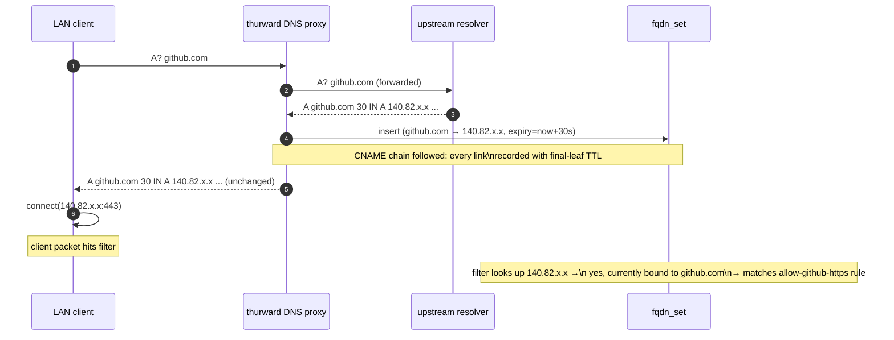

# 04 — FQDN & DNS

*Audience: anyone debugging an FQDN-rule miss or an unexpected drop.
Pairs with the DNS-proxy flow diagram.*

The decision to filter by FQDN at all — and to do it via a DNS proxy
rather than periodic pre-resolution — lives in
[ADR 0004](decisions/0004-dns-proxy-for-fqdn-rules.md). This chapter
covers the implementation details and the edge cases.

## The DNS-proxy flow

<!-- canonical source: diagrams/dns-proxy-flow.mmd -->

## Production-grade behaviours

The proxy isn't a toy. The following are explicit M3 acceptance
criteria for the implementation phase (per the approved plan):

- **UDP truncation handling.** If the upstream response has `TC=1`,
  re-issue the same query over TCP/53 and serve the TCP response back
  over either UDP (if it fits) or TCP (if the client sent the original
  query over TCP).
- **EDNS0.** Respect client EDNS0 buffer-size advertisements; advertise
  our own buffer size upstream.
- **CNAME chains.** Follow CNAME chains in responses, recording each
  link in `fqdn_set` with the *final-leaf TTL* (not the CNAME's own
  TTL — the leaf's TTL is the binding lifetime).
- **NXDOMAIN / SERVFAIL passthrough.** Never synthesise responses;
  pass through whatever upstream returns. Don't cache failure responses.
- **Per-client rate-limiting.** Bound the QPS per source IP. Default
  100 QPS, configurable. Excess queries get SERVFAIL. This caps how
  fast a misbehaving client can grow `fqdn_set`.

## `fqdn_set` cache

- **Key:** destination IP (so the filter can look up an arbitrary
  packet's `dst_ip` in O(1)).
- **Value:** a small struct `{ qname_id: u16, expiry: i64 }`. `qname_id`
  indexes into `fqdn_strtab` from the compiled rule table
  (see [03 — Rule model](03-rule-model.md)) — so we don't store
  the qname string per entry.
- **Capacity:** bounded (default 32k entries). When full, oldest
  entries are evicted regardless of TTL.
- **Expiry:** lazy. Checked on every lookup; expired entries return as
  a miss.
- **No negative caching.** A miss means "not currently bound" — the
  filter must treat it as no FQDN match (so the rule scan continues
  to the next rule, eventually hitting default-deny).

## Pitfalls and what we do about them

| Pitfall                                                        | Effect                                              | Mitigation                                                                                  |
| -------------------------------------------------------------- | --------------------------------------------------- | ------------------------------------------------------------------------------------------- |
| Client hardcodes `8.8.8.8` (bypasses thurward's resolver)      | FQDN policy doesn't apply to that client's flows.   | **Operational:** block UDP/TCP 53 to anything-but-thurward on the LAN, or transparent NAT.  |
| Client uses DoH / DoT to a remote resolver                     | Same as above; encrypted, undetectable from packets. | **Operational:** block known DoH endpoints, or use TLS SNI blocking upstream of thurward.   |
| Upstream resolver returns wrong / poisoned IPs                  | thurward happily caches them.                       | Use a resolver you trust; ideally DNSSEC-validating. Future: DNSSEC validation in the proxy. |
| Very short TTLs (CDNs at 30s, sometimes 5s)                    | `fqdn_set` churn; cache thrash.                     | Honour TTL exactly. Per-client rate limit caps lookup explosion.                            |
| Client connects to an IP without ever resolving it             | No `fqdn_set` entry → FQDN rule never matches.      | Documented limitation; if you want IP-based rules, use `destination:` not `destination_fqdn:`. |
| TTL clock skew across CNAME chain                              | Some links expire before others.                    | Use the *final-leaf TTL* for every link in the chain.                                       |
| Restart loses the cache                                        | All FQDN rules cold-start until clients re-resolve. | Optional `fqdn_set_warm` events recorded host-side and replayed at boot; not required for v1. |

## Implementation note: DNS proxy on the data-path pipeline

Under [ADR 0017](decisions/0017-hermit-rust-substrate.md), there is no
socket layer in the image — `smoltcp::iface` and `smoltcp::socket` are
not linked. The DNS proxy is implemented as a small Rust UDP handler
on the data-path's parsing pipeline: packets destined for
`10.0.0.1:53` are diverted from the forwarding sequence into the
proxy, which constructs UDP/53 responses (and TCP/53 fallback on
truncation) using `smoltcp::wire::{UdpPacket, TcpPacket}` and emits
them through the same TX path as forwarded packets.

This is the v1 implementation target. There is no socket-layer escape
hatch — the proxy lives or dies as direct frame-level code.

## Out of scope (v1)

- **DoH/DoT termination inside thurward.** Possible future feature;
  currently the proxy is plain DNS only.
- **DNSSEC validation.** Worth adding; not in v1.
- **EDNS Client Subnet (ECS).** Not forwarded; would leak client IPs
  to upstream. Strip on forward.
