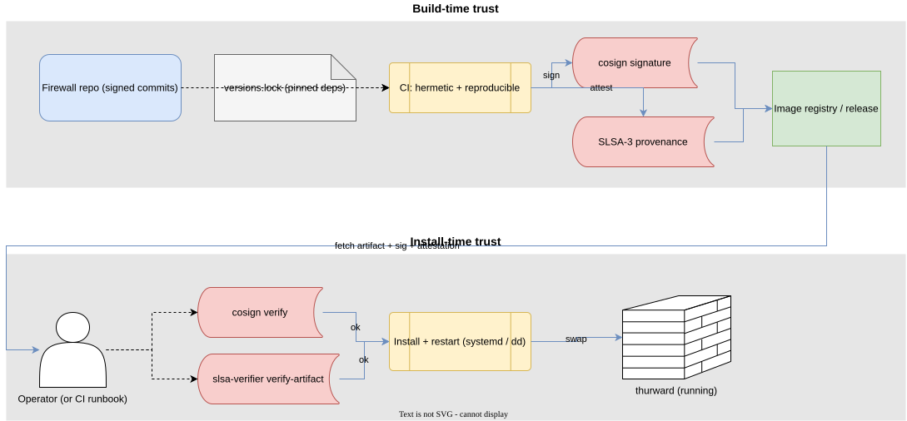

# 08 — Security model

*Audience: anyone reviewing thurward's threat posture or doing a
security review of a deployment.*

## Threat model (STRIDE-lite)

| STRIDE category    | Threat                                                                                  | Mitigation                                                                                                                          |
| ------------------ | --------------------------------------------------------------------------------------- | ----------------------------------------------------------------------------------------------------------------------------------- |
| **Spoofing**       | Attacker forges packets with arbitrary `source.ip` to bypass source-based rules.        | Source-IP-based rules are coarse by nature; pair with L4 state where possible (`state: established`). Anti-spoofing on upstream router. |
| **Tampering**      | Attacker modifies the running image.                                                    | Image is read-only `const` data in a unikernel; no on-disk state. Cosign-signed; operator runs `cosign verify` before install (ADR 0010/0016). |
| **Repudiation**    | Operator denies making a rule change.                                                   | Signed commits + branch protection (ADR 0010/0016); every change is in git, attributed, attestable.                                  |
| **Info disclosure**| Observability traffic leaks to a network attacker.                                      | Vsock egress only (ADR 0006); no observability traffic on data NICs.                                                                |
| **DoS**            | LAN client floods DNS proxy.                                                            | Per-client QPS limit in the proxy (ADR 0004).                                                                                       |
| **DoS**            | Packet flood saturates the Rust fast path.                                              | Single-vCPU baseline holds at ~1 Gbps ([ADR 0013](decisions/0013-zig-fast-path-on-uknetdev.md), [ADR 0017](decisions/0017-hermit-rust-substrate.md)); per-rule + per-source rate limits and conntrack capacity caps in [09 — Limitations](09-limitations.md). Anti-DDoS at scale is out of scope; pair with upstream scrubbing. |
| **DoS**            | Attacker exhausts conntrack or SNAT port pool to deny service to legitimate flows.       | Per-source rate limits, alerts on `nat_port_pool_in_use` and conntrack pressure ([05](05-observability.md), [07](07-operations.md)); table capacities sized at build time per [ADR 0014](decisions/0014-stateful-nat.md). |
| **Elevation**      | Attacker compromises the firewall to attack the LAN.                                    | Smallest viable attack surface (no shell, no mgmt port). Image rebuilt + redeployed on any suspected compromise.                    |
| **Supply chain**   | Compromised CI ships a malicious image.                                                 | Reproducible builds + cosign + SLSA-3 provenance + user-side verification at install (`cosign verify`, `slsa-verifier`). See ADR 0010 and the diagram below.                   |

## Attack surface

Exhaustively, the surfaces an attacker can reach are:

1. **WAN-facing virtio NIC** — receives whatever the upstream router
   sends. The Rust fast path
   ([ADR 0013](decisions/0013-zig-fast-path-on-uknetdev.md),
   [ADR 0017](decisions/0017-hermit-rust-substrate.md)) parses headers
   using `smoltcp::wire` (zero-copy, fuzzed, slice-based); malformed
   packets are dropped at parse. There is no general-purpose TCP/IP
   socket layer to fuzz between the driver and the filter.
2. **LAN-facing virtio NIC** — same posture, plus the DNS proxy
   listens here.
3. **DNS proxy on LAN-side UDP/53 + TCP/53** — the *only* application-
   level listener in the image. Threat surface: DNS parser bugs,
   amplification, query rate.
4. **virtio-vsock egress** — outbound only, no listener. The host's
   `socat VSOCK-LISTEN:9000` is the listener; it lives on the host's
   trust boundary, not the firewall's.

There is no inbound management surface
([ADR 0016](decisions/0016-image-per-change-user-deploy.md)). No SSH,
no admin API, no metrics scrape endpoint inside the VM. Configuration
changes happen out-of-band by rebuilding the image with new rules and
swapping the running unit.

## Supply-chain hardening

This is where [ADR 0010](decisions/0010-supply-chain-hardening.md) does
its work. The diagram shows what's pinned, signed, and verified at each
hop:

In words:

1. **Source repos** (code + rules) require signed commits and N-reviewer
   branch protection on `main`.
2. **CI build environment** is pinned (Nix flake or container SHA).
   Network-isolated; deps fetched against a content-addressed proxy.
3. **Build inputs** (Rust toolchain channel + components, every
   transitive crate in `Cargo.lock`, the Unikraft revision plus each
   selected `lib-*` component revision, the smoltcp crate version)
   are pinned in `versions.lock`. CI fails on drift. See
   [ADR 0018](decisions/0018-substrate-pivot-unikraft.md) (substrate),
   [ADR 0017](decisions/0017-hermit-rust-substrate.md) (language +
   parser), and
   [ADR 0010](decisions/0010-supply-chain-hardening.md).
4. **Build output** is reproducible — byte-identical given the same
   inputs.
5. **Image is signed** with `cosign sign` and ships a SLSA-3 provenance
   attestation linking image-SHA → source-SHA → CI run.
6. **Image registry** stores the image and its signatures/attestations.
7. **Deploy controller** verifies, per image, that:
   - cosign signature matches a configured set of keys,
   - SLSA provenance points to the expected source repo,
   - the source SHA was on the protected branch when built.
   Failures = no deploy, period.

## What we explicitly do not defend against

- **DoH / encrypted DNS bypass.** Clients that use DoH or hardcode
  remote resolvers escape FQDN policy. Mitigation is operational
  ([04 — FQDN & DNS](04-fqdn-and-dns.md)).
- **L7 attacks past an allow rule.** thurward filters at L3/L4; if a
  rule allows TCP to `:443`, what flows over that TLS connection is
  not inspected. Use a separate WAF / TLS-MITM appliance if needed.
- **Side-channel attacks on the hypervisor.** thurward inherits the
  host hypervisor's isolation posture (KVM, Firecracker microVM).
  We assume KVM is sound; covered by the host's threat model.
- **Compromise of the upstream DNS resolver.** It can poison FQDN
  rules silently. Use a resolver you trust; ideally DNSSEC-validating.
- **Compromise of the host running thurward.** A compromised host can
  read vsock, swap images, observe traffic. thurward is one component
  of a larger trust boundary, not a substitute for it.
- **Asymmetric routing** — if traffic to a flow takes one path and
  return traffic takes another, stateful rules break. Out of scope.
- **IPv6** — explicitly not supported in v1; IPv6 packets are dropped
  unconditionally.

## Image signing keys

For v1, image-signing keys are operator-supplied to cosign at CI
time, and the operator's `cosign verify` trust root is configured
to the public-key counterpart at install time. Sigstore's keyless
flow (Fulcio short-lived certs) is the recommended production path
but is not mandated — long-lived key pairs are acceptable if
they live in a hardware security module and have a documented
rotation cadence.
